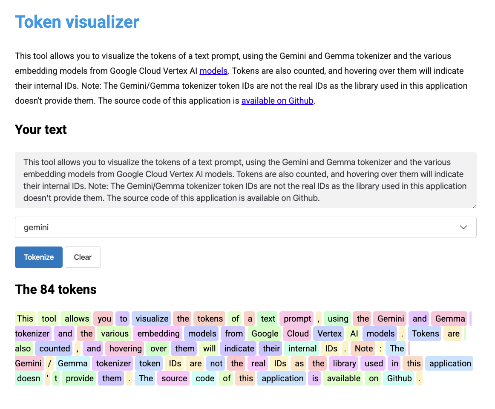

# Visualize Google Gemini, Gemma, and Vertex AI embedding models tokenization

With this application, you can better understand how 
[large language models](https://cloud.google.com/vertex-ai/docs/generative-ai/language-model-overview) 
tokenize your text.

Enter your text, select a model, and see how it is tokenized!

## Models currently supported

### Large Language Models

* `gemini` (Gemini and Gemma use the same tokenizer and share the same vocabulary)

### Embedding models

* `text-embedding`
* `text-multilingual-embedding`
* `textembedding-gecko`
* `textembedding-gecko-multilingual`
* `text-bison`
* `text-unicorn`
* `chat-bison`
* `code-gecko`
* `code-bison`
* `codechat-bison`

## Try it out!

You can [try this application online](https://tokens-lpj6s2duga-ew.a.run.app/).
